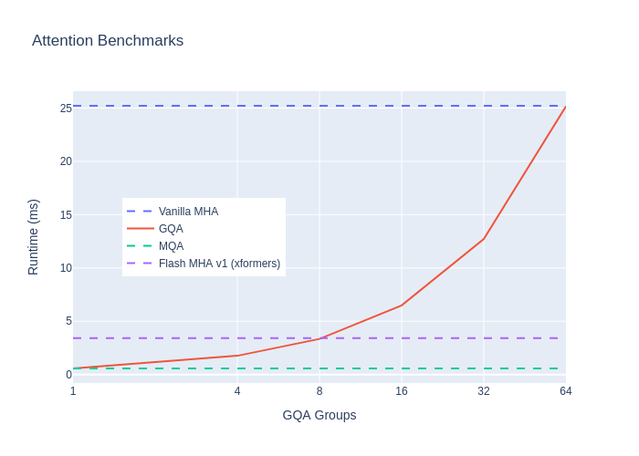

# scripts

Scripts should be launched from the root of this repository.  Ex:

```bash
python -m scripts.benchmark_attention
```


## benchmark_attention

Gather runtime benchmarks for scaled dot product attention with grouped queries.  In particular, we want to see how the runtime scales with the number of queries.  We compare vanilla (naive) attention compares to grouped attention.  We also compare against `xformers.ops.memory_efficient_attention` as a strong baseline.

### Reference
The original paper benchmarks end-to-end runtime of the T5 model (https://arxiv.org/pdf/2305.13245v1.pdf, Figure 6).  We do that in a separate benchmark (see `scripts/benchmark_t5.py`).  Here, we focus on the attention layer itself.

### Results

Clearly, runtime scales similarly with the number of GQA groups.  

Even through `xformers` is much faster than the naive implementation, GQA is still faster when the number of groups is small.  Hopefully, someone will write an efficient CUDA implementation for GQA, so we can get the best of both worlds.  Unfortunately, I likely don't have the CUDA experience to do it myself. :(

#### This repo (attention layer only)



#### Original paper (end-to-end T5)


